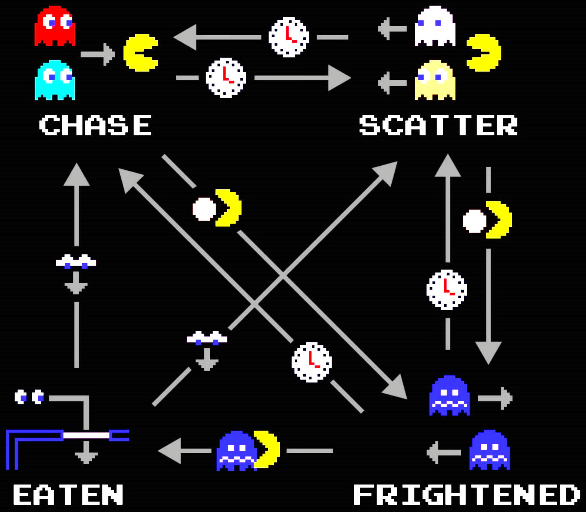

# NeoPac
v0.1
## Descrição
Este sistema consiste em um ambiente simulado baseado no clássico **Pacman**, onde o agente principal (**Pacman**) é controlado de forma autônoma por um algoritmo de busca heurística $A*$. Utilizando a **Distância de Manhattan** como heurística adaptativa, o agente é capaz de calcular rotas otimizadas para recolher elementos do cenário enquanto desvia dinamicamente de fantasmas através da manipulação de pesos e custos na matriz do mapa.
## Funcionalidades
- Personagem jogável ou controlado por algoritmo $A*$
- 4 fantasmas com movimentação distintas
- Sistema de pontuação por rodadas
- Frutas especiais que permitem ao **Pacman** devorar os fantasmas
- Interface de UI
## Tecnologias e Técnicas de IA
- Agentes inteligentes para controle de entidades
- Algoritmo $A*$ para controle do **Pacman**
- Heurística '**Distância de Manhattan**'
## FAQ - Perguntas Frequentes
### Por que utilizar o algoritmo $A*$ no agente do **Pacman**?
Naturalmente, existem diversas formas de implementar um agente que controle o personagem. Pensei inicialmente em utilizar _**Q-Learning**_ para experimentar o uso de **aprendizado por reforço**, mas devido ao prazo de entrega e requisitos passados pela professora, optei por um algoritmo mais simples, que permitisse a adição de um agente autônomo mantendo uma relativa simplicidade.
### O que controla os fantasmas?
Conforme o jogo original, criado por **Tōru Iwatani**, os 4 fantasmas presentes no mapa (**Blinky**, **Pinky**, **Inky** e **Clyde**) possuem diferentes 'personalidades', ou seja, algoritmos ligeiramente diferentes. A ideia é que por um determinado período cada fantasma possua um *target* para onde devem se locomover, a entidade (fantasma) tenta então mover-se para uma direção (cima, baixo, direita, esquerda). Imediatamente, a direção da qual ele veio é eliminada, assim como qualquer direção que leve a uma parede. Para decidir entre as opções restantes, eles utilizam a fórmula da **Distância de Manhattan** em relação ao alvo, descrita na *[Wikipedia](https://pt.wikipedia.org/wiki/Geometria_do_t%C3%A1xi)* como:

>*forma de geometria em que a usual métrica da geometria euclidiana é substituída por uma nova métrica em que a distância entre dois pontos é a soma das diferenças absolutas de suas coordenadas.*
 
Além da movimentação, cada fantasma alterna entre quatro **estados de comportamento** (*mood*) que define qual o seu objetivo atual. Sendo eles:
-  ***Chase***: O fantasma vira em 180 graus (uma exceção à regra citada anteriormente) e seu *target* é atualizado para a posição do jogador **a cada tomada de decisão**.
- ***Scatter***: O fantasma vira em 180 graus (uma exceção à regra citada anteriormente) e **seu *target* é definido para um dos cantos do mapa** (cada fantasma possui um canto pré-definido).
- ***Frightened***: O jogador coletou uma fruta e por determinado período, todos os fantasmas se viram em 180 graus (uma exceção à regra citada anteriormente) e então **avançam em uma direção aleatória a cada tomada de decisão**.
- ***Eaten***: Caso o jogador faça contato físico com um fantasma durante o estado *frightened*, ele passa para o estado *eaten* **onde não pode afetar o jogador até retornar à *ghost cage*** (centro do mapa) com o seu *target* sendo posicionado na frente da entrada desta área. Chegando lá, muda para o estado *chase* ou *scatter*.

*Imagem e conceitos retirados [deste](https://youtu.be/ataGotQ7ir8?si=Oc1PzYdHzopza5ju) vídeo.*

### O agente que controla o **Pacman** melhora com o tempo?
Não, pois ele não possui **aprendizagem de máquina**, mas sim um algoritmo com base em pontuações.
### Você criou o projeto completamente do zero?
Não, eu escrevi o código, mas seguindo este tutorial https://youtu.be/9H27CimgPsQ?si=CkwaHQNqF-9Yocta, também utilizando este vídeo como apoio https://youtu.be/ataGotQ7ir8?si=tMRHgmOcDYblITO.
### Quais as entradas e saídas da aplicação?
- **Entrada**: Jogador escolhe se vai controlar o personagem, ou se deixará o algoritmo controlá-lo.
- **Saída**: O sistema exibe o tempo de execução da rodada, assim como a pontuação final, número de orbes e frutas especiais coletados e número de fantasmas devorados.
### Quais as tecnologias utilizadas para o desenvolvimento?
**Python** e **Pygame**, assim como **Git** e **Github** (também hospedado no **Codeberg**) para gerenciamento de repositório.
## Referências
- GHOSTS (Pac-Man). In: **WIKIPEDIA**: the free encyclopedia. Flórida: Wikimedia Foundation, 2026. Disponível em: <https://en.wikipedia.org/wiki/Ghosts_(Pac-Man)>. Acesso em: 7 jun. 2026.
- HOW to Make Pac-Man in Python!. [s. l.]: LeMaster Tech, 25 out. 2022. 1 vídeo (4h 30min 46s). Publicado pelo canal LeMaster Tech. Disponível em: <https://youtu.be/9H27CimgPsQ>. Acesso em: 7 jun. 2026.
- PAC-MAN Ghost AI Explained. [s. l.]: Retro Game Mechanics Explained, 13 jul. 2019. 1 vídeo (19min 34s). Publicado pelo canal Retro Game Mechanics Explained. Disponível em: <https://youtu.be/ataGotQ7ir8>. Acesso em: 7 jun. 2026.
- TAXICAB geometry. In: **WIKIPEDIA**: the free encyclopedia. Flórida: Wikimedia Foundation, 2026. Disponível em: <https://en.wikipedia.org/wiki/Taxicab_geometry>. Acesso em: 7 jun. 2026.
